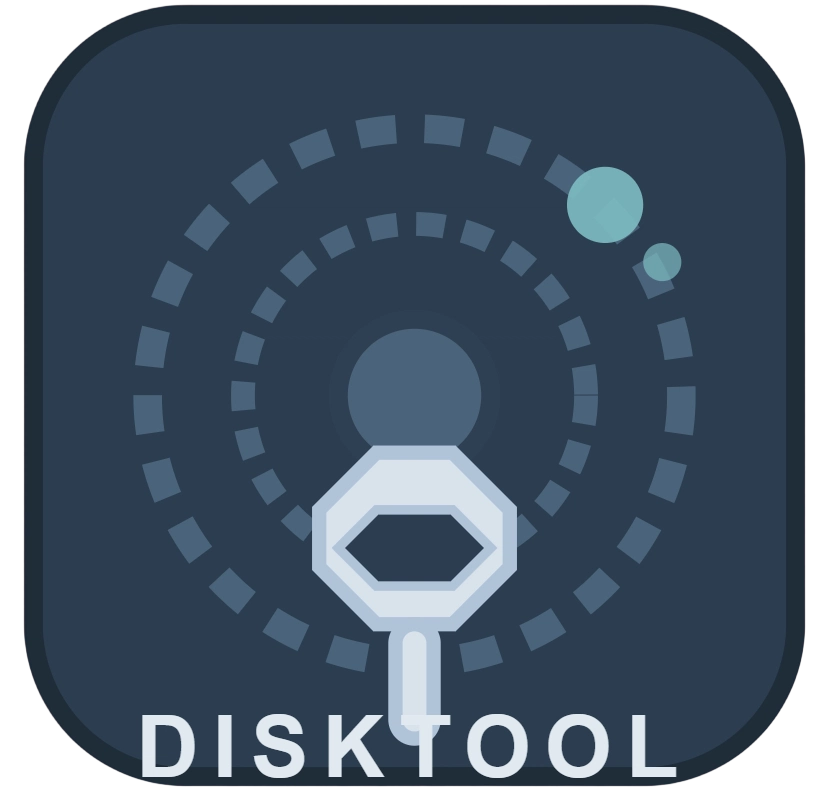

<h1>DiskTool</h1>
<h3>使用 C 开发的磁盘工具</h3>


[](https://github.com/deeplearning-corporation/disktool/releases)

## 下载 DiskTool
可以通过：https://github.com/deeplearning-corporation/disktool/releases 下载 DiskTool.exe

## 可以干什么
你可以在 DiskTool 中检查硬盘健康度、性能。希望这些功能能帮助到你。

## 协议
本 App 应用程序采用 MIT License 许可证。如果您改动了次应用，MIT 许可证不要求您开源。

## 编译
你可以在 Windows 系统使用 compile.cmd 编译，在 Linux 或 Windows Subsystem for Linux 使用 Makefile 编译
Windows 系统 compile.cmd 可以直接打开
Linux 则需要先安装 Make

```bash
sudo apt update
sudo apt install make
```

然后输入：
```bash
make
```

进行编译

## 编译前后
编译前需要先创建一个叫 build 的文件夹
这里面会放 .o 文件

编译后 build 目录会有一个 disktool.exe 可以在 Windows 运行（所以建议 Windows 编译）

## 感谢阅读
感谢阅读 REAMDME 文档！
##
